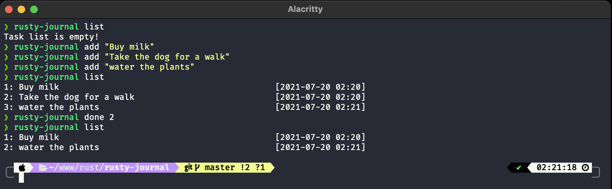

<div align="center">
<h1>Rusty Journal</h1>

A command line to-do app written in Rust.

**README Sections:** [Options](#options) — [Installation](#installation) - [License](#license)

<!-- Badges -->
</div>



---

## Options

```
Rusty Journal 0.1.0
A command line to-do app written in Rust and SQLite

USAGE:
    rusty_journal <SUBCOMMAND>

FLAGS:
    -h, --help       Prints help information
    -V, --version    Prints version information

SUBCOMMANDS:
    add         Write a task to the journal file
    delete      Delete an given task by id
    done        Set a task completed by id
    help        Prints this message or the help of the given subcommand(s)
    list        List resting tasks from the journal file
    list-all    List all tasks from the journal file
    reset       Delete all tasks
    update      Update task description by id
```

---

## Installation

_Rusty journal_ is written in [Rust](https://www.rust-lang.org/), so you'll need to grab a Rust installation in order to compile it. The recommended way to install Rust for development is from the [official download page](https://www.rust-lang.org/tools/install), using rustup.

Once Rust is installed, you can compile _Rusty journal_ with Cargo:

```bash
# Download the repo
$ git clone https://github.com/juliencrn/rusty-journal
$ cd rusty-journal

# Create an .env file with the database path
$ echo "DATABASE_URL=testing_db.db" > .env

# Initiate ORM
$ diesel setup
$ diesel migration run

# Build, use...
$ cargo build --release
$ ./target/release/rusty_journal --version
> Rusty Journal 0.1.0
$ cargo run -- --help
```

## License
Distributed under the MIT License. See [`LICENSE`](./LICENSE) for more information.
