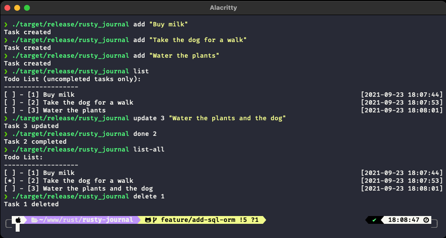

<div align="center">
<h1>Rusty Journal</h1>

A command line to-do app written in Rust.

**README Sections:** [Options](#options) — [Installation](#installation) - [License](#license)

<!-- Badges -->
</div>



---

## Options

```
Rusty Journal 0.1.0
A command line to-do app written in Rust

USAGE:
    rusty_journal [OPTIONS] <SUBCOMMAND>

FLAGS:
    -h, --help       Prints help information
    -V, --version    Prints version information

OPTIONS:
    -j, --journal-file <journal-file>    Use a different journal file

SUBCOMMANDS:
    add     Write tasks to the journal file
    done    Remove an entry from the journal file by position
    help    Prints this message or the help of the given subcommand(s)
    list    List all tasks in the journal file
```

---

## Installation

_Rusty journal_ is written in [Rust](https://www.rust-lang.org/), so you'll need to grab a Rust installation in order to compile it. The recommended way to install Rust for development is from the [official download page](https://www.rust-lang.org/tools/install), using rustup.

Once Rust is installed, you can compile _Rusty journal_ with Cargo:

```bash
# Download the repo
$ git clone https://github.com/juliencrn/rusty-journal
$ cd rusty-journal

# Create an .env file with the database path
$ echo "DATABASE_URL=testing_db.db" > .env

# Initiate ORM
$ diesel setup
$ diesel migration run

# Build, use...
$ cargo build --release
$ ./target/release/rusty_journal --version
> Rusty Journal 0.1.0
$ cargo run -- --help
```

## License
Distributed under the MIT License. See [`LICENSE`](./LICENSE) for more information.
